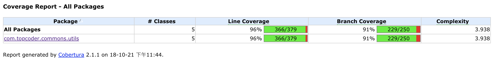

# Topcoder Utils

A maven demo.

### 概 述

基于Maven实现Utils工具类。主要功能有：

* 日志打印工具类
* `.properties`文件相关操作工具类
* 变量格式验证工具类

### 文 档

访问：[**JavaDoc**](./docs/javadoc/index.html)

### 测 试

基于JUnit编写测试用例，总体代码测试覆盖率超过95%。使用`Cobertura`工具。

测试log：[**Test Log**](./test.log)

### 代码格式检查

源代码严格遵循`Sun Checks`标准。使用Checkstyle进行代码检查。

格式检查报告：[**Checkstyle Report**](./target/site/checkstyle.html)

